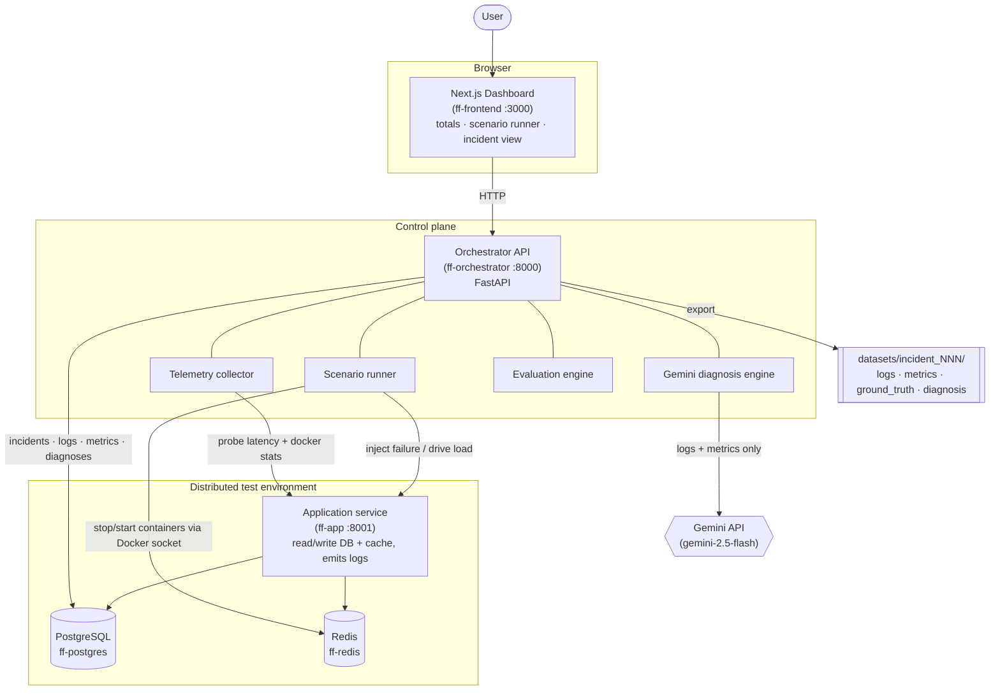
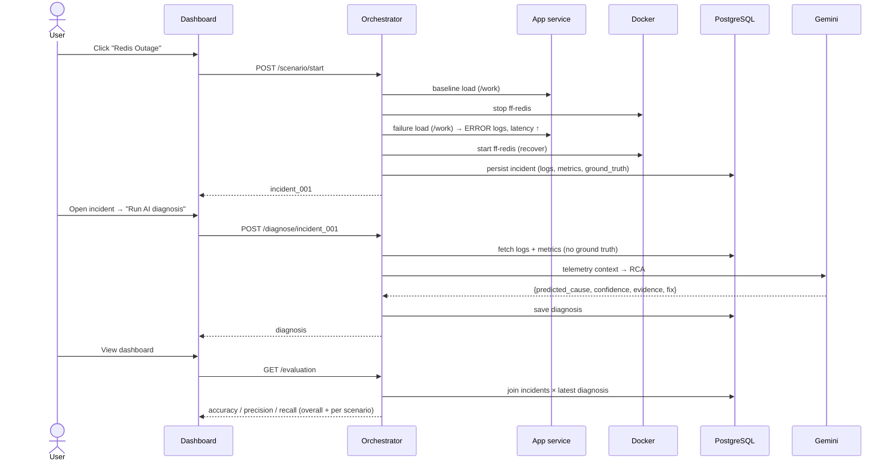
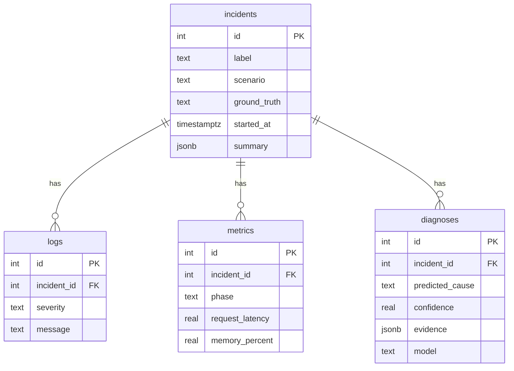

# FailureForge — Architecture

FailureForge simulates realistic distributed-systems failures, captures
observability data, asks an AI to diagnose the root cause, and scores that
diagnosis against known ground truth.

## Components

## Diagnosis & evaluation flow

## Failure scenarios

| Scenario | Injection | Ground truth | Key symptom |
|---|---|---|---|
| Redis Outage | stop the `ff-redis` container | `redis_outage` | `Redis connection refused`, latency ↑ |
| Database Deadlock | concurrent opposite-order transactions | `database_deadlock` | `deadlock detected`, aborted txns |
| Memory Leak | retained allocations vs `256m` limit | `memory_leak` | `memory_percent` ↑, `OOM warning` |
| Slow Database | `pg_sleep` injected into `/work` | `slow_database` | high `request_latency` |

## Data model (PostgreSQL)

See `docs/PHASE1.md`–`docs/PHASE5.md` for per-phase detail.
